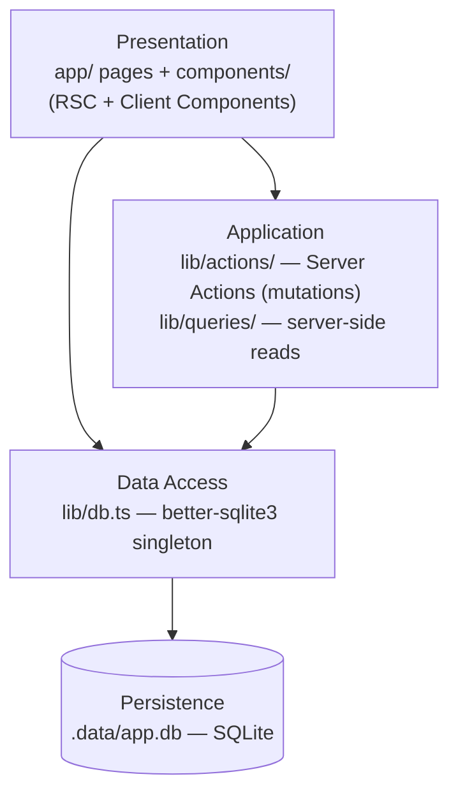
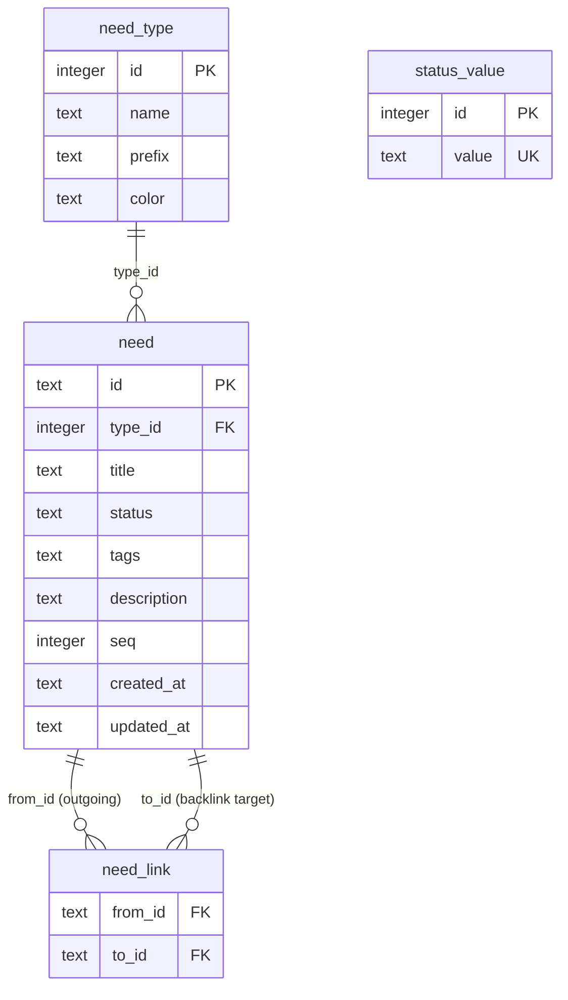

# Architecture Spine — Sphinx Needs Clone (Next.js MVP)

## Design Paradigm

**Server-Centric Layered** on Next.js 16 App Router. Four layers; dependency flows downward only:



- **Presentation** — React Server Components (pages, layouts) and Client Components (interactive table, sheet, filter bar). Pages are RSC by default; `'use client'` is applied only at the lowest subtree that requires interactivity.
- **Application** — Server Actions (`lib/actions/`) own all mutations. Query functions (`lib/queries/`) own all reads and are called directly by RSC pages. Neither is reachable from Client Components directly — mutations reach Server Actions via passed references or form actions.
- **Data Access** — `lib/db.ts` exports the single `better-sqlite3` `Database` instance, initialized once per process. Schema creation (`CREATE TABLE IF NOT EXISTS`) runs here on module load.
- **Persistence** — SQLite file at `.data/app.db`; directory is gitignored.

## Invariants & Rules

### AD-1 — All database access is server-side only

- **Binds:** All FRs, NFR-1
- **Prevents:** `better-sqlite3` bundled into the client bundle; runtime crashes in the browser
- **Rule:** `lib/db.ts` must carry `import 'server-only'` at the top. No Client Component may import from `lib/db.ts`, `lib/queries/`, or `lib/actions/`. Client Components trigger mutations exclusively via Server Action function references passed as props or via HTML form actions.

---

### AD-2 — Server Actions own mutations; RSC pages own reads; one Route Handler for autocomplete

- **Binds:** FR-4, FR-5, FR-6, FR-10, FR-15
- **Prevents:** Parallel mutation paths to the same entity (Route Handler + Server Action); reads that bypass the query layer
- **Rule:** Every create/update/delete is a `'use server'` async function in `lib/actions/`. RSC pages call `lib/queries/` functions directly — no `fetch()`, no Route Handlers for internal reads. The single exception is `app/api/needs/search/route.ts` (a GET Route Handler), used only for the link-search autocomplete (FR-10) because it requires streaming a response while the user types — Server Actions are unsuitable for this pattern.

---

### AD-3 — Backlinks are computed at read time; never stored

- **Binds:** FR-9
- **Prevents:** Backlink state diverging from the `need_link` table (stale denormalized data)
- **Rule:** No `backlinks` column exists on the `need` table. Backlinks are always derived via `SELECT from_id FROM need_link WHERE to_id = ?` in `lib/queries/needs.ts`. The `need_link` junction table is the single source of truth for all link relationships in both directions.

---

### AD-4 — ID generation is server-side; sequential counter per type prefix

- **Binds:** FR-4, FR-7
- **Prevents:** Duplicate IDs from client-side generation; IDs that don't match the stored prefix
- **Rule:** The Server Action computes auto-generated IDs as `{PREFIX}_{padStart(MAX(seq)+1, 3, '0')}` where `seq` is an integer column on the `need` row. The client receives the generated default and may override it before final save. Uniqueness is enforced by a `UNIQUE` constraint on `need.id`. A SQLite UNIQUE violation is caught in the Server Action and returned as `{ success: false, error: "ID already in use", field: "id" }` — never an unhandled throw.

---

### AD-5 — Filter and sort state is owned by URL search params

- **Binds:** FR-11, FR-12
- **Prevents:** Filter state lost on refresh; two components owning the same filter state
- **Rule:** The filter bar writes filter values to URL search params via `useRouter` / `useSearchParams`. The RSC page reads `searchParams` and passes them to the query layer, which builds the WHERE clause. There is no separate React state for active filters — the URL is the single source of truth. Filters are therefore bookmarkable and refresh-safe by construction.

---

### AD-6 — Single generic link type; `need_link` has no type column in MVP

- **Binds:** FR-8, FR-9, FR-10
- **Prevents:** Premature schema complexity; blockers on v2 link-type extension
- **Rule:** The `need_link` table has exactly two columns: `from_id TEXT` and `to_id TEXT` (composite PK). No `link_type` column. When link types are added post-MVP, a nullable `link_type TEXT` column with a default is appended via `ALTER TABLE need_link ADD COLUMN IF NOT EXISTS` — no backfill required.

---

### AD-7 — Need-type color is stored in DB; never hardcoded in components

- **Binds:** FR-2, FR-3
- **Prevents:** Type badge colors diverging from user config; hardcoded color assumptions
- **Rule:** The `need_type` table stores a `color TEXT` column (hex string, e.g. `#2563EB`). The `NeedTypeBadge` component receives `color` as a prop and applies it via an inline style or CSS custom property — not a Tailwind color utility class (which requires static analysis). Components never import a static color map keyed by type name.

---

### AD-8 — Schema initialization at process startup; no migration framework

- **Binds:** FR-15, FR-16, NFR-3
- **Prevents:** App failing on first run; requiring a manual migration step before `npm run dev`
- **Rule:** `lib/db.ts` executes `CREATE TABLE IF NOT EXISTS` for every table on module initialization. Future column additions use `ALTER TABLE … ADD COLUMN IF NOT EXISTS` appended to the same init block. [ASSUMPTION: sufficient for a single-user local SQLite app; a multi-user or production deployment would require a proper migration framework such as Drizzle Migrate.]

---

### AD-9 — `'open'` status value is seeded at DB init; cannot be deleted

- **Binds:** FR-4
- **Prevents:** App launching with no valid default status; empty status dropdown on need create
- **Rule:** After table creation, `lib/db.ts` runs `INSERT OR IGNORE INTO status_value (value) VALUES ('open')`. The `deleteStatus` Server Action returns `{ success: false, error: "Cannot delete the default status" }` when the target value is `'open'`.

---

### AD-10 — Foreign keys are enforced at runtime; need.type_id is RESTRICT on delete

- **Binds:** FR-3, FR-6
- **Prevents:** Needs referencing a deleted type silently returning NULL type data; NeedTypeBadge receiving undefined color and crashing
- **Rule:** `lib/db.ts` runs `PRAGMA foreign_keys = ON` immediately after opening the database (SQLite disables FK enforcement by default). `need.type_id` is declared with `ON DELETE RESTRICT`. The `deleteNeedType` Server Action therefore returns a structured error when any need references the type — never a raw SQLite exception.

---

### AD-11 — need_link rows are deleted in the same transaction as the owning need

- **Binds:** FR-6, FR-9
- **Prevents:** Orphaned `need_link` rows causing ghost backlinks on deleted need IDs
- **Rule:** The `deleteNeed` Server Action wraps its work in a single SQLite transaction: `DELETE FROM need_link WHERE from_id = ? OR to_id = ?` followed by `DELETE FROM need WHERE id = ?`. Both statements are committed atomically. There is no ON DELETE CASCADE on `need_link` — the Server Action owns this cleanup explicitly, keeping the schema portable.

---

### AD-12 — ID generation uses a serialized SQLite transaction; no optimistic read-then-write

- **Binds:** FR-4, FR-7
- **Prevents:** Two concurrent Server Action invocations reading the same MAX(seq) and producing the same generated ID; silent UNIQUE collision under parallel requests
- **Rule:** The `createNeed` Server Action wraps the entire `SELECT MAX(seq)` + `INSERT` in a single `BEGIN IMMEDIATE` transaction. SQLite's write-serialization guarantees that only one writer enters at a time; a second concurrent call blocks until the first commits. No application-level retry loop is needed.

---

### AD-13 — URL search param keys are defined here; both FilterBar and RSC page must use them verbatim

- **Binds:** FR-11, FR-12
- **Prevents:** FilterBar and the RSC page independently choosing divergent key names or value encodings, producing silently empty query results
- **Rule:** The canonical search param keys are: `type` (comma-joined type names), `status` (comma-joined status values), `tags` (comma-joined tag values, any-of match), `q` (free-text search string). Multi-value filters use comma-joining, never repeated keys. These constants are exported from `types/index.ts` as `SEARCH_PARAM_KEYS` and imported by both `FilterBar` and `app/page.tsx` — never hardcoded as string literals in either.

## Consistency Conventions

| Concern | Convention |
|---|---|
| File naming | `kebab-case` for directories and non-component files; `PascalCase.tsx` for React components |
| Server Action naming | `verbNoun` in `lib/actions/` — `createNeed`, `updateNeed`, `deleteNeed`, `createNeedType` |
| Query function naming | `getNoun` / `listNouns` in `lib/queries/` — `getNeed`, `listNeeds`, `listNeedTypes` |
| Need IDs | `TEXT` in SQLite; uppercase prefix + `_` + zero-padded 3-digit counter (`REQ_001`) |
| Dates | ISO 8601 strings in SQLite `TEXT` columns; never stored as Unix timestamps; parsed to `Date` only at display boundary |
| Server Action return shape | `{ success: true, data: T }` or `{ success: false, error: string, field?: string }` — no throws across the Server Action boundary |
| Tags | Stored as comma-separated `TEXT` in the `need` row; split/join at the query/action boundary — never stored as JSON |
| TypeScript | Strict mode; shared entity interfaces in `types/index.ts`; no `any` anywhere in `lib/` or `components/`; DB row types are `interface`, not `type` |
| `'use client'` scope | Applied at the lowest subtree needing interactivity — never on page files or root layout |
| shadcn primitives | Generated into `components/ui/` via CLI; never hand-edited; re-export from there into feature components |
| URL search param keys | Defined as `SEARCH_PARAM_KEYS` in `types/index.ts`; imported by `FilterBar` and `app/page.tsx` — never as string literals (AD-13) |

## Stack

| Name | Version | Note |
|---|---|---|
| Next.js | 16.2.10 | [ASSUMPTION — verify App Router API stability on final setup] |
| TypeScript | 7.0.2 | [ASSUMPTION — verify tsconfig compatibility with Next.js 16 plugin] |
| Tailwind CSS | 4.3.3 | CSS-based config (no tailwind.config.js); content scanning auto-detects `app/` and `components/` |
| shadcn/ui | CLI 2.x (components from registry) | Initialized via `npx shadcn@latest init` |
| better-sqlite3 | 12.11.1 | Verify prebuilt binary available for Node 22; if not, node-gyp build required |
| @types/better-sqlite3 | must match better-sqlite3 major (12.x) | [ASSUMPTION — confirm correct @types version on install] |
| Node.js | 22 LTS | |

## Structural Seed

Core entity model:



Source tree (seed — code owns once it exists):

```text
/
  app/
    layout.tsx              # root layout; ThemeProvider (system default)
    page.tsx                # RSC: fetches needs + types + statuses → NeedsTable
    settings/
      page.tsx              # RSC: fetches types + statuses → settings UI
    api/
      needs/
        search/
          route.ts          # GET autocomplete for link search (FR-10) — only Route Handler
  components/
    needs/
      NeedsTable.tsx        # 'use client' — table, sort, row click; reads URL search params
      NeedSheet.tsx         # 'use client' — create/edit sheet; calls Server Actions
      FilterBar.tsx         # 'use client' — filter inputs; writes URL search params
      NeedTypeBadge.tsx     # presentational; receives color as prop (AD-7)
    settings/
      NeedTypeTable.tsx     # 'use client' — type CRUD
      StatusList.tsx        # 'use client' — status value CRUD
    ui/                     # shadcn primitives — CLI-generated, untouched
  lib/
    db.ts                   # better-sqlite3 singleton + schema init (server-only — AD-1, AD-8)
    queries/
      needs.ts              # listNeeds (filter args → WHERE clause), getNeed
      config.ts             # listNeedTypes, listStatuses
    actions/
      needs.ts              # createNeed, updateNeed, deleteNeed (AD-2, AD-4)
      types.ts              # createNeedType, updateNeedType, deleteNeedType
      statuses.ts           # createStatus, deleteStatus (AD-9)
  types/
    index.ts                # Need, NeedType, StatusValue, NeedLink, CreateNeedInput, UpdateNeedInput, …
  .data/                    # gitignored; app.db lives here (AD-8)
```

## Capability → Architecture Map

| Capability / FR | Lives in | Governed by |
|---|---|---|
| Need type config (FR-1–3) | `app/settings/`, `components/settings/NeedTypeTable`, `lib/actions/types.ts` | AD-1, AD-2, AD-7 |
| Need CRUD (FR-4–7) | `components/needs/NeedSheet`, `lib/actions/needs.ts` | AD-1, AD-2, AD-4, AD-8, AD-11, AD-12 |
| Links / backlinks (FR-8–10) | `lib/queries/needs.ts`, `app/api/needs/search/route.ts` | AD-3, AD-6, AD-11 |
| Needs table + filter (FR-11–14) | `components/needs/NeedsTable`, `components/needs/FilterBar`, `app/page.tsx` | AD-5, AD-13 |
| Data persistence / init (FR-15–16) | `lib/db.ts` | AD-1, AD-8, AD-9, AD-10 |
| Status config | `app/settings/`, `components/settings/StatusList`, `lib/actions/statuses.ts` | AD-2, AD-9 |
| Need type config (FK enforcement, delete guard) | `lib/actions/types.ts`, `lib/db.ts` | AD-10 |

## Deferred

| Decision | Reason deferred |
|---|---|
| Multiple link types | MVP has one generic link type (AD-6); migration path documented in AD-6 |
| SQLite FTS5 full-text search | At ≤ 500 needs (NFR-2), JS `Array.filter()` on the fetched list is sufficient; FTS5 adds schema complexity for no gain at this scale |
| `useOptimistic` for optimistic UI | Server Actions + `revalidatePath` is correct for MVP; optimistic updates are an incremental enhancement |
| Authentication / session layer | Out of scope per PRD; would slot between Presentation and Application layers |
| Pagination | Out of scope per NFR-2; add when need count warrants it |
| DB migration framework (e.g. Drizzle Migrate) | `CREATE TABLE IF NOT EXISTS` in `lib/db.ts` is sufficient for single-user local SQLite (AD-8) |
| Need detail as dedicated route (`/needs/[id]`) | UX spine chose sheet overlay; route-based deep linking deferred until sharing is a need |
